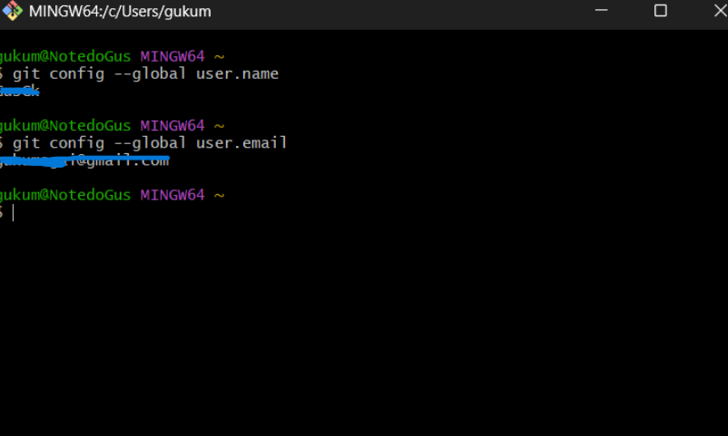
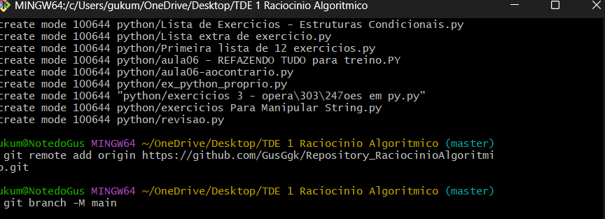
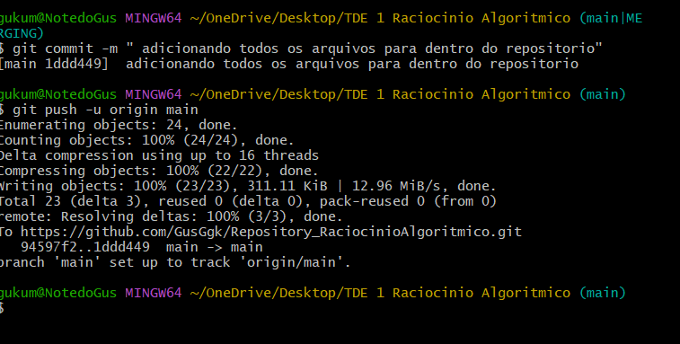

# 💻 Projeto de Raciocínio Algorítmico


## 📋 Descrição

Este repositório contém os exercícios e práticas desenvolvidas na disciplina de **Raciocínio Algorítmico**, com foco na utilização do **Git** e do **GitHub** para controle de versão, organização e documentação dos códigos.
<p>
  (lembrando que é para o TDE 1 de Raciocínio Algorítmico, do primeiro Periodo de Engenharia de Software na PUCPR).

Aqui, demonstro o uso de commits organizados, branches, merges e estruturação básica de projetos utilizando Git.

---

## 🚀 Tecnologias Utilizadas

- [x] Git
- [x] GitHub
- [x] VSCode
- [x]  Python / Portugol
- [x] Markdown (`README.md`)


---

## 🧠 Conceitos Aplicados

✅ Instalação e configuração do Git  
✅ Criação de repositórios e versionamento com commits claros  
✅ Uso de branches e pull requests simulados  
✅ Integração com GitHub e documentação com Markdown  

---

## 🖼️ Demonstrações / Screenshots

### 📌 Git configurado (userName and Email)


### 📌 Commits organizados
```bash
Antes de tudo usei o comando git init para inicializar o git
usei o git add . para adicionar todos os arquivos que eu já tinha da materia!
```


### 📌 Pull Request e Merge


---


<p align="center">
  
</p>

---

## 🛠️ Como Executar

```bash
Para executar poderia usar esse metodo ou tambem outro:
# Clone o repositório
git clone https://github.com/SEU_USUARIO/NOME_REPOSITORIO.git

# Acesse a pasta
cd NOME_REPOSITORIO

# (Se necessário) compile ou execute o código
gcc src/arquivo_codigo.c -o programa
./programa

o outro seria (caso você já tivesse uma pasta, ou até de um metodo mais explicado para fazer e aprender seria esse:
#Abrir o Git Bash
#Procurar sua pasta no Computador aonde você vai querer incluir em seu repositorio
cd C:/Desktop/caminho_Do_arquivo
#Inicializar o git
git init
#Adicionar os arquivos já feitos ou qualquer coisa dentro de sua pasta
git add . # git add . adiciona tudo poderia usar escrevendo apenas o nome do arquivo tambem
#Criar o remoto com seu Repositorio já feito aqui (no meu caso seria):
git remote add origin "https://github.com/GusGgk/Repository_RaciocinioAlgoritmico.git"
# Entrar na sua branch para o futuro commit
git branch -M main # no meu caso foi a main(padrao na maioria das vezes)
# Criar a mensagem do commit
git commit -m "Adicionando arquivos para meu repositorio"
#Passe tudo de fato para seu repositorio
git push -u origin main
