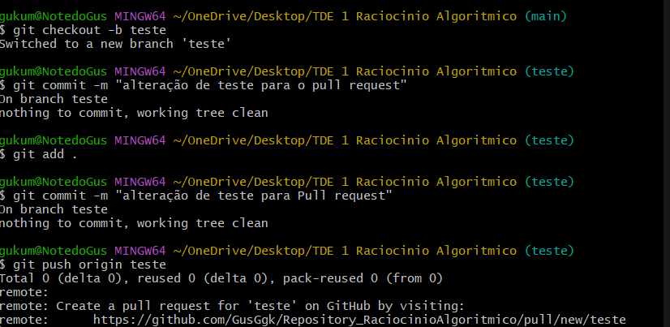
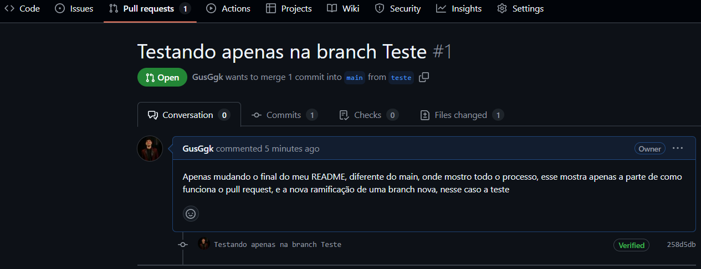

# 💻 Projeto de Raciocínio Algorítmico


## 📋 Descrição

Este repositório contém os exercícios e práticas desenvolvidas na disciplina de **Raciocínio Algorítmico**, com foco na utilização do **Git** e do **GitHub** para controle de versão, organização e documentação dos códigos.
<p>
  (lembrando que é para o TDE 1 de Raciocínio Algorítmico, do primeiro Periodo de Engenharia de Software na PUCPR).

Aqui, demonstro o uso de commits organizados, branches, pull requests, merges e estruturação básica de projetos utilizando Git.

---

## 🚀 Tecnologias Utilizadas

- [x] Git
- [x] GitHub
- [x] VSCode
- [x]  Python / Portugol
- [x] Markdown (`README.md`)


---

## 🧠 Conceitos Aplicados

✅ Criação de uma nova branch (teste)
✅ Criação de Pull Request 

---

## 🖼️ Demonstrações / Screenshots

### 📌 Criação da branch teste


### 📌 Pagina do pull request



---


<p align="center">
  
</p>

---

## 🛠️ Como Executar

```bash
# Isso aqui é a branch teste, apenas para testar e mostrar como funcionou o processo
git checkout -b teste
#depois desse codigo eu basicamente acessei a branch, fiz uma alteração e agora falta apenas commitar... MEsmo esquema de sempre
git add .
git commit -m "" #escreva a mensagem
